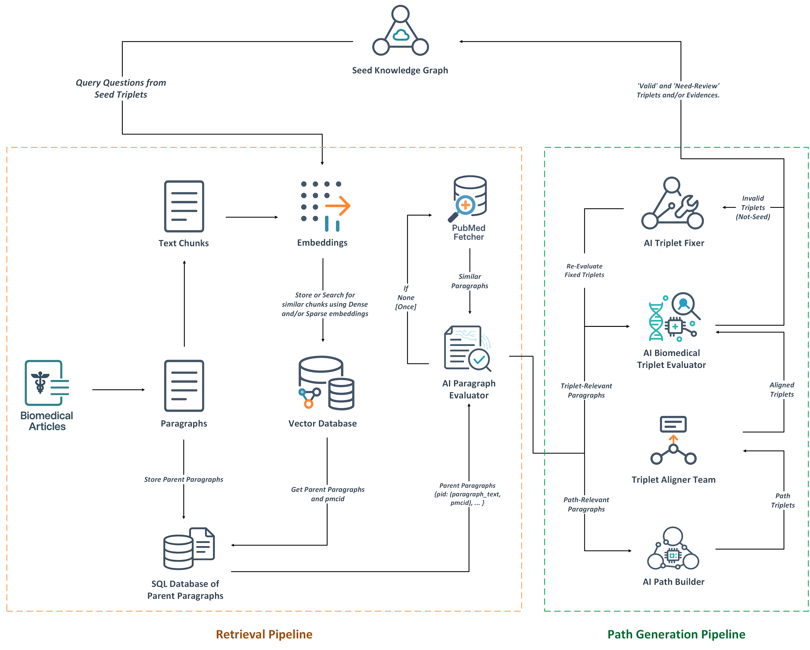

# KG-Orchestra

KG-Orchestra is a multi-agent LLM framework for validating and expanding biomedical knowledge graphs (KGs) using curated corpora and PubMed/PMC web sources. Starting from a seed KG (Neo4j or CSV) of typed triples with evidence, it:

- Validates each seed triple against both curator evidence and retrieved extra evidence (with auditable provenance).
- Searches for directed, multi-hop mechanistic/functional/causal paths connecting head to tail.
- Aligns new information to the current KG schema (entity types, relation vocabulary), performs entity matching/creation, evidence-backed validation, and adds validated triplets/evidence to the KG.

Outputs are fully auditable and include per-triplet reports, paragraph relevance scoring, intermediate/aligned hops, final decisions, and provenance (PMCID/DOI + excerpted paragraphs).



## Key Features

- End-to-end enrichment/validation loop for biomedical KGs
- Multi-agent pipeline
  - ParagraphEvaluator (relevance ranking)
  - PathwayBuilder (directed path construction)
  - HopAligner (schema alignment)
  - EntityMatcherEvaluator (entity resolution)
  - HopValidationTeam (triplet validation and repair)
- Dual retrieval pipeline
  - Qdrant vector stores (biomedical corpora + UMLS harmonization store)
  - PubMed/PMC web pipeline (NCBI E-utilities + paragraph extraction + dense ranking)
- Entity harmonization via UMLS vector index
- Evidence-preserving integration (Neo4j relationships with evidence arrays)
- Robust timeout/restart handling for local LLMs via Ollama
- Rich export artifacts under ./.output for auditability

## Architecture Overview

1. Load seed KG (Neo4j or CSV): typed (head, relation, tail) triples with evidence.
2. Validate seed triple:
   - Retrieve relevant paragraphs (vector stores → parent paragraph mapping; fallback to PubMed/PMC).
   - Rank/evaluate paragraphs; validate against curator and extra evidence.
3. If configured for enrichment:
   - Build directed path (source → target) from relevant paragraphs.
   - Align hop schema (entity types to broad classes; relations to mechanistic/polarity-aware).
   - Match entities (resolve to existing KG nodes via UMLS CUI or create new ones).
   - Validate/repair individual hops; add valid ones to KG with provenance.
4. Persist results:
   - Neo4j: add relationships or new evidence; set validation flags and LLM metadata.
   - CSV mode: update enriched CSV in place.
   - Export per-triplet/process artifacts to ./.output.

## Repository Structure

- main.py — CLI entry point and orchestration
- modules/
  - agents.py — LLM agents for evaluation, pathway construction, alignment, matching
  - clients.py — Qdrant fetchers (UMLS, PubMed corpora), SQLite parent-paragraph fetcher
  - neo4j_io.py — SeedKG/CSV loading, KG updates, KGEnricher loop
  - output_models.py — Pydantic models for structured LLM outputs
  - biomedical_models.py — Core entity/triplet models and SQLAlchemy ORM for paragraphs
  - pubmed.py — PubMed/PMC pipeline, paragraph extraction, dense ranking

## Requirements

- Python: 3.9–3.11 recommended
- GPU strongly recommended (for embeddings and local LLMs via Ollama)
- Services:
  - Neo4j 5.x (optional if using CSV)
  - Qdrant (two collections recommended: UMLS and biomedical corpora)
  - SQLite DB for parent paragraph lookup
  - Ollama (local LLM inference)
- Internet access (for PubMed/PMC fallback and model downloads)

Python packages (install via pip):
- langchain-ollama, sentence-transformers, transformers, torch, qdrant-client, pydantic, sqlalchemy, neo4j, requests, numpy, pandas, tqdm
- Optional: beautifulsoup4 (HTML parsing), pdfminer.six (PDF extraction)

## Installation

```bash
# 1) Clone
git clone https://github.com/Fraunhofer-SCAI-Applied-Semantics/KG-Orchestra.git
cd KG-Orchestra

# 2) Install with PDM (creates/uses a managed virtual environment)
pip install pdm
pdm install
```

Install and run Ollama (If not already installed):
```bash
# https://ollama.ai
curl -fsSL https://ollama.com/install.sh | sh
ollama serve &
# pull a model (choose one you have VRAM for)
ollama pull qwen3:32b
# or any other model (e.g., qwen2.5:14b-instruct, llama3.1:8b-instruct)
```

Run Biomedical and UMLS Qdrant (two instances or one instance with two collections):
```bash
# Example: two local instances on different ports
podman run -p 10333:6333 -p 10334:6334 qdrant/<biomedical_copora_qdrant_folder>:latest   # Biomedical corpora
podman run -p 11333:6333 -p 11334:6334 qdrant/<umls_qdrant_folder>:latest   # UMLS store
```

Run Seed KG on Neo4j (if using graph mode):
```bash
pdoman run -p 7474:7474 -p 7687:7687 -e NEO4J_AUTH=neo4j/neo4j_pass neo4j:5
```

## Data Setup

1) UMLS Qdrant collection (Entity Harmonizer):
- Collection name (default): all-MiniLM-L12-v2-splade-v3-umls-synonyms-with-types
- Vectors:
  - dense_vector_name: all-MiniLM-L12-v2
  - sparse_vector_name: splade-v3
- Payload expectations per point:
  - cui: UMLS CUI string (e.g., "C0011849")
  - synonyms: canonical synonym string (or synonym list serialized)
  - Optional type fields are fine, but semantic matching uses cui and synonyms

2) Biomedical corpora Qdrant collection (retrieval):
- Collection name (default): neurodegenerative_diseases_papers
- Vectors:
  - dense_vector_name: nomic-embed-text-v2-moe
  - sparse_vector_name: splade-v3
- Payload expectations per point:
  - parent_paragraph_id: string/int referencing a row in your SQLite table

3) SQLite paragraphs DB:
- Path provided via --paragraph_db_path
- Schema (table name: paragraphs)
  - paragraph_id (primary key)
  - pmcid (PMCID or DOI)
  - paragraph_text (full paragraph, not sentence chunks)

Example SQL:
```sql
CREATE TABLE IF NOT EXISTS paragraphs (
  paragraph_id TEXT PRIMARY KEY,
  pmcid TEXT NOT NULL,
  paragraph_text TEXT NOT NULL
);
```

4) Seed KG (choose one):
- Neo4j: existing graph with nodes labeled and mapped to UMLS (or mappable)
- CSV mode:
  - Provide --seed_csv_path pointing to CSV with these columns:

| Column                         | Description |
|--------------------------------|-------------|
| head_node_id                   | Neo4j elementId or stable ID (string) |
| head_node_name                 | Head entity string |
| head_node_type                 | Head entity type (free text) |
| relation_type                  | Relation label (string) |
| tail_node_id                   | Tail entity ID |
| tail_node_name                 | Tail entity string |
| tail_node_type                 | Tail entity type |
| curator_evidence_pmid          | Optional PMID for curator evidence |
| curator_evidence_text          | Optional curator evidence text |
| llm_generated_rel              | False for seed triples (True for LLM-added) |

On first run in CSV mode, an enriched CSV is created (adds UMLS mapping/provenance columns).

## Quick Start

Minimal example (Neo4j mode, local Ollama, local Qdrant, SQLite paragraphs):
```bash
pdm run python -m kg_orchestra \
  --neo4j_url bolt://localhost:7687 \
  --neo4j_username neo4j \
  --neo4j_password neo4j_pass \
  --neo4j_database seed-kg \
  --ollama_port 11434 \
  --llm qwen3:32b \
  --bio_qdrant_p 10333 \
  --umls_qdrant_p 11333 \
  --paragraph_db_path /path/to/paragraphs.db \
  --user_email you@example.com \
  --top_k 10 \
  --timeout 1200
```

CSV mode:
```bash
pdm run python -m kg_orchestra \
  --seed_csv_path /path/to/seed_triplets.csv \
  --enriched_csv_path /path/to/seed_triplets_enriched.csv \
  --ollama_port 11434 \
  --llm qwen2:7b-instruct \
  --bio_qdrant_p 10333 \
  --umls_qdrant_p 11333 \
  --paragraph_db_path /path/to/paragraphs.db \
  --user_email you@example.com
```

Note on HPC module environments:
- `__main__.py` attempts module load {--ollama_module}. If you aren’t on a module-based cluster, either ignore the harmless warning or set a no-op value and/or comment this line.

## CLI Reference

| Flag | Type | Default | Description |
|------|------|---------|-------------|
| --neo4j_url | str | bolt://localhost:7687 | Neo4j URI |
| --neo4j_username | str | neo4j | Neo4j username |
| --neo4j_password | str | 55555555 | Neo4j password |
| --neo4j_database | str | seed-kg | Neo4j database name |
| --start | int | 0 | Start from triplet index (sorted by head) |
| --end | int | -1 | End triplet index (exclusive); -1 = full |
| --ollama_port | int | 11434 | Ollama server port |
| --llm | str | qwen3:32b | Ollama model ID (choose an installed one) |
| --llm_temperature | float | 0.0 | LLM generation temperature |
| --ollama_module | str | ollama/0.11.10-... | HPC module to load (optional) |
| --umls_qdrant_p | int | 11333 | UMLS Qdrant port |
| --umls_collection_name | str | all-MiniLM-L12-v2-splade-v3-umls-synonyms-with-types | UMLS collection name |
| --umls_dv_name | str | all-MiniLM-L12-v2 | UMLS dense vector name |
| --umls_sv_name | str | splade-v3 | UMLS sparse vector name |
| --umls_dense_m | str | sentence-transformers/all-MiniLM-L12-v2 | UMLS dense HF model |
| --umls_sparse_m | str | naver/splade-v3 | UMLS sparse HF model |
| --bio_qdrant_p | int | 10333 | Biomedical corpora Qdrant port |
| --bio_collection_name | str | neurodegenerative_diseases_papers | Biomedical collection |
| --bio_dv_name | str | nomic-embed-text-v2-moe | Biomedical dense vector name |
| --bio_sv_name | str | splade-v3 | Biomedical sparse vector name |
| --bio_dense_m | str | nomic-ai/nomic-embed-text-v2-moe | Biomedical dense HF model |
| --bio_sparse_m | str | naver/splade-v3 | Biomedical sparse HF model |
| --trial | str | kg_orchestra_trial | Trial label for outputs |
| --user_email | str | you@domain | Email for NCBI E-utilities (required) |
| --paragraph_db_path | str | /path/to/paragraphs.db | SQLite paragraphs DB |
| --seed_csv_path | str | None | Seed CSV path (CSV mode) |
| --enriched_csv_path | str | None | Enriched CSV path (CSV mode) |
| --top_k | int | 10 | Top-K paragraphs/chunks to consider |
| --timeout | int | 1200 | Timeout (seconds) for LLM steps |

## How It Works (Step-by-Step)

1. Retrieval pipeline:
   - Vector-store retrieval (Qdrant): fetch top-k chunks and map to parent paragraphs via SQLite.
   - LLM-based paragraph evaluator: label each paragraph as STRONGLY_RELEVANT / PARTIALLY_RELEVANT / IRRELEVANT.
   - Fallback: PubMed/PMC web pipeline (NCBI E-utilities → PMC JATS/PDF/HTML → strict paragraph extraction → dense ranking).
2. Triplet validation:
   - Validate seed triple against curator evidence and multiple extra evidence paragraphs.
3. Pathway construction:
   - Build a directed path from head (source) to tail (target) using only evidence paragraphs; enforce direction and sequential connectivity.
4. Schema alignment:
   - Map head/tail types to broad classes; align relation to mechanistic/polarity-aware relation set; fall back gracefully.
5. Entity matching:
   - Resolve extracted entities to existing KG nodes via name+type or UMLS CUI; or create LLM-generated nodes with UMLS mapping.
6. Hop validation and repair:
   - Evaluate biological validity, semantic coherence, and directionality.
   - Attempt repair (relation normalization) up to 3 tries using only evidence text.
7. Integration:
   - Add valid triplets to Neo4j (or CSV), appending evidence arrays and LLM flags; otherwise record need-review status.
8. Auditable outputs:
   - Per-triplet folders with paragraphs, evaluations, initial/aligned/matched/evaluated hops and pathways, decisions.

## Outputs

- Folder: ./.output/{trial}_{database}_{start}_{end}/{llm}/
  - triplets//
    - pubmed_paragraphs.txt
    - chunks_evaluations.json
    - initial_pathway.json
    - aligned_hops.txt
    - final_hops.json
    - hop_evaluations.json
    - fixed_hops.json
    - final_pathway.json
  - original_hops.csv, aligned_hops.csv, matched_triplets.csv, evaluated_fixed_triplets.csv
  - original_pathways.csv, aligned_pathways.csv, matched_pathways.csv, evaluated_fixed_pathways.csv

Neo4j side-effects:
- Relationships:
  - r.extra_evidence: list of evidence dicts (pmcid_or_doi, paragraph_text, relevance note)
  - r.llm_generated: bool
  - r.llm_model: model ID
  - r.validation_by_extra_evidence, r.validation_by_curator_evidence
  - r.llm_validated: true after validation
- Nodes:
  - mapped_umls_cui, mapped_umls_synonym
  - llm_generated (if newly created)

## Tips and Best Practices

- Use a model your machine can handle (e.g., qwen2:7b-instruct or llama3.1:8b-instruct). Larger models can improve accuracy but need more VRAM.
- Ensure your Qdrant payload schemas match expectations:
  - Biomedical corpora points must include payload.parent_paragraph_id.
  - UMLS store points must include payload.cui and payload.synonyms.
- Keep SQLite paragraphs as whole paragraphs (no chunking); the framework performs strict paragraph-level reasoning.
- Set --user_email to comply with NCBI usage guidelines; the pipeline rate-limits requests appropriately.
- If timeouts occur, reduce --top_k, or use a smaller LLM.

## Troubleshooting

- Paragraph retrieval returns nothing:
  - Verify Qdrant ports and collection names.
  - Ensure payload.parent_paragraph_id matches a row in SQLite.
  - Check --paragraph_db_path and schema (paragraph_id, pmcid, paragraph_text).
- Entity mapping errors:
  - Confirm UMLS Qdrant payload has cui and synonyms.
- Ollama errors/timeouts:
  - The framework tries to restart Ollama. Ensure ollama serve is reachable on --ollama_port and model is pulled.
- Neo4j write issues:
  - Confirm credentials, database, and that your user can write.
- Module load errors:
  - If not on an HPC module system, ignore or remove module load lines in main.py.

## Extensibility

- Swap embedding models via CLI flags (umls_dense_m, bio_dense_m, umls_sparse_m, bio_sparse_m).
- Swap LLM (any Ollama-supported chat model).
- Extend schema alignment rules or relation vocab in agents.HopAligner and output_models.
- Integrate new retrieval sources by adding a new fetcher client mirroring PubmedFetcher.

## Disclaimer

This software is for research purposes only and does not constitute medical advice. Always verify outputs with domain experts.

## Citation

If you use KG-Orchestra in your research, please cite this repository. A formal citation will be added in a future release.

## License

MIT

## Acknowledgements

- NCBI E-utilities and PMC Open Access resources
- Sentence-Transformers, SPLADE, Qdrant, Neo4j, LangChain, Ollama, and the open-source LLM community
